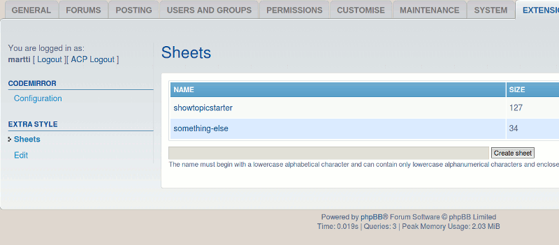
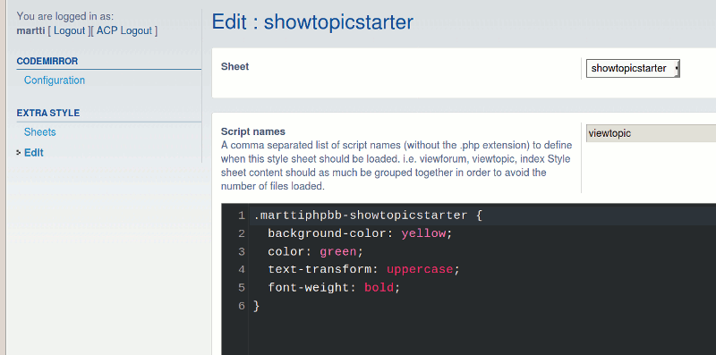
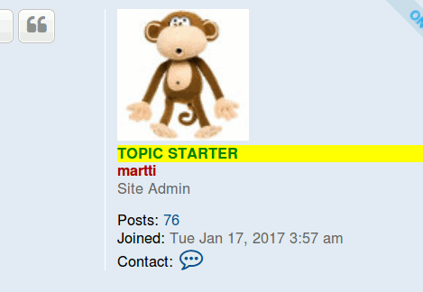

# PhpBB Extension - marttiphpbb Extra Style

[Topic on phpBB.com](https://www.phpbb.com/community/viewtopic.php?f=456&t=2473561)

## Requirements

* phpBB 3.2.1+
* PHP 7+
* the extension [marttiphpbb/codemirror](https://github.com/marttiphpbb/phpbb-ext-codemirror)

## Features

With this extension you can define extra (small) style sheets. 
This can come in handy to style content that extensions add to the 
board.

## Quick Install

You can install this on the latest release of phpBB 3.2 by following the steps below:

* Create `marttiphpbb/extrastyle` in the `ext` directory.
* Download and unpack the repository into `ext/marttiphpbb/extrastyle`
* Enable `Extra Style` in the ACP at `Customise -> Manage extensions`.
* Install the [marttiphpbb/codemirror](https://github.com/marttiphpbb/phpbb-ext-codemirror) extension.
* You can start adding and editing the Extra Style sheets in the ACP.

## Uninstall

* Disable `Extra Style` in the ACP at `Customise -> Extension Management -> Extensions`.
* To permanently uninstall, click `Delete Data`. Optionally delete the `/ext/marttiphpbb/extrastyle` directory.

## Support

* Report bugs and other issues to the [Issue Tracker](https://github.com/marttiphpbb/phpbb-ext-extrastyle/issues).

## License

[GPL-2.0](license.txt)

## Screenshots

### ACP sheets

### ACP edit sheet

We are styling here the content of the [Show Topic Starter](https://github.com/marttiphpbb/phpbb-ext-showtopicstarter) extension which doesn't provide styling of its own.

### Result

(Content by the [Show Topic Starter](https://github.com/marttiphpbb/phpbb-ext-showtopicstarter) extension)
